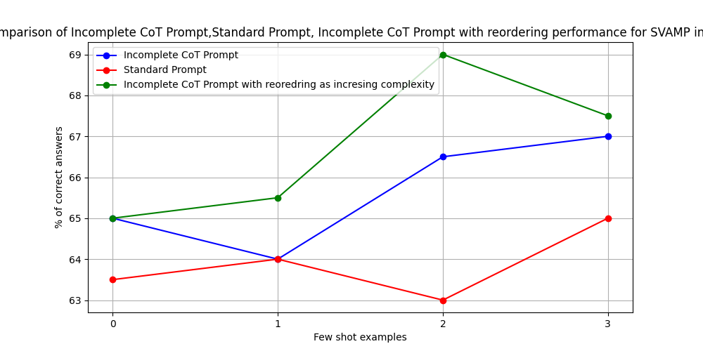
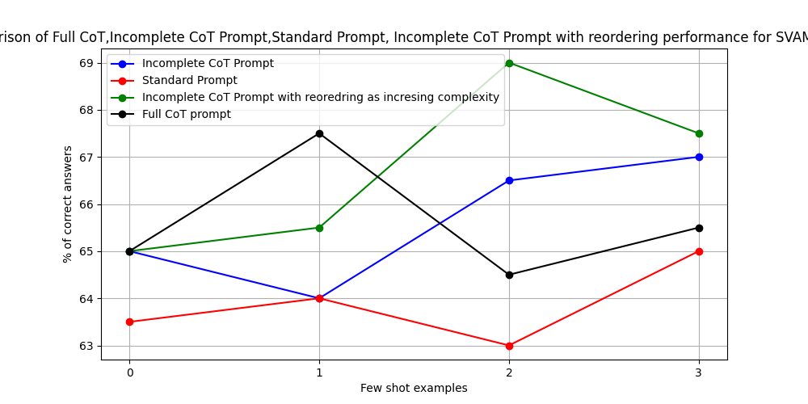

# Reasonability-of-LLMs-An-Experiment-with-PaLM-text-bison-001

 ## SUVENDU's Contribution:
 Hi! Welcome and thank you for your interest in exploring my work on understanding LLMs( PaLM text bison 001) reasoning ability through various types of CoT prompts.Detailed report of my work can be found at the attached pdf file: **[Experiments Towards Understanding Reasoning Ability of LLMs throught CoT Prompting(1).pdf](https://github.com/jvdutt/NLP_project/blob/main/PaLM/Experiments%20Towards%20Understanding%20Resasoning%20Ability%20of%20LLMs%20throught%20CoT%20Prompting%20(1).pdf)**.**File naming convention**:evaluation_PaLM_{number of exemplars}shot_{prompting method.CoT=CHAIN OF THOUGHT prompting, standard=STANDARD PROMPTING}_{Data set name. If no data set name is there then it is GSM8K}.txt

 ## Obtained Results:
 
 
 
 
 
 
