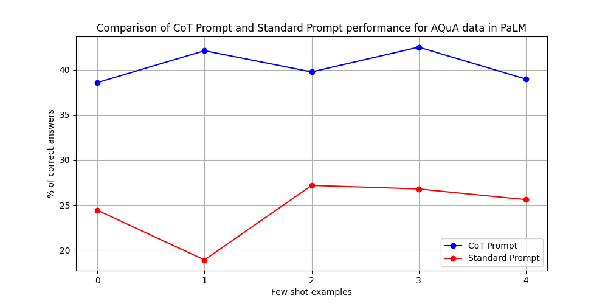
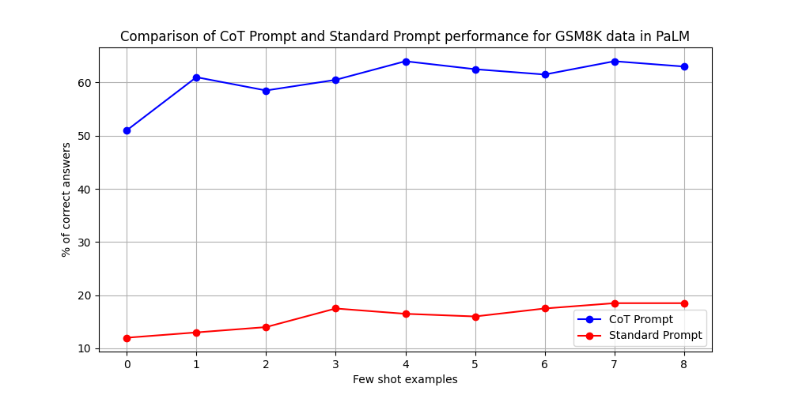
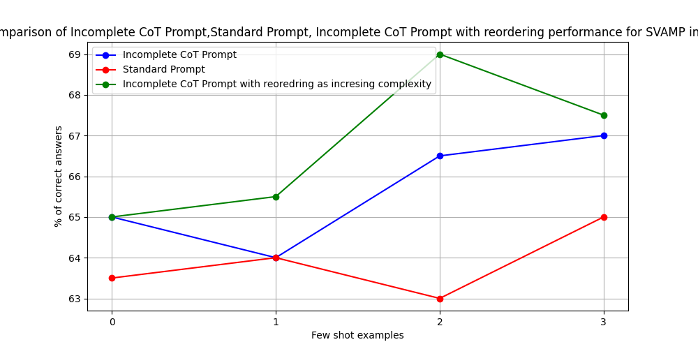
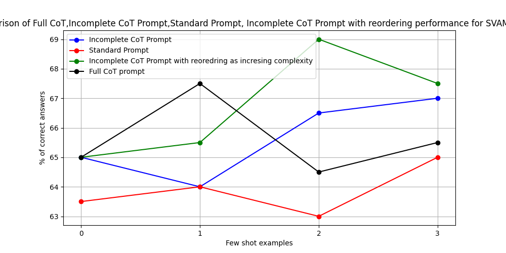
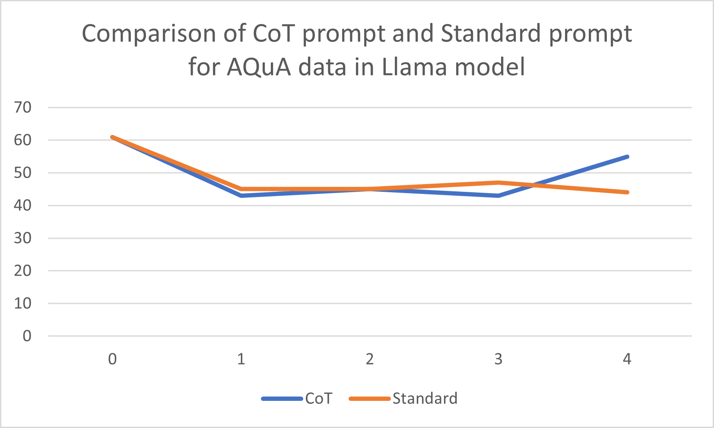
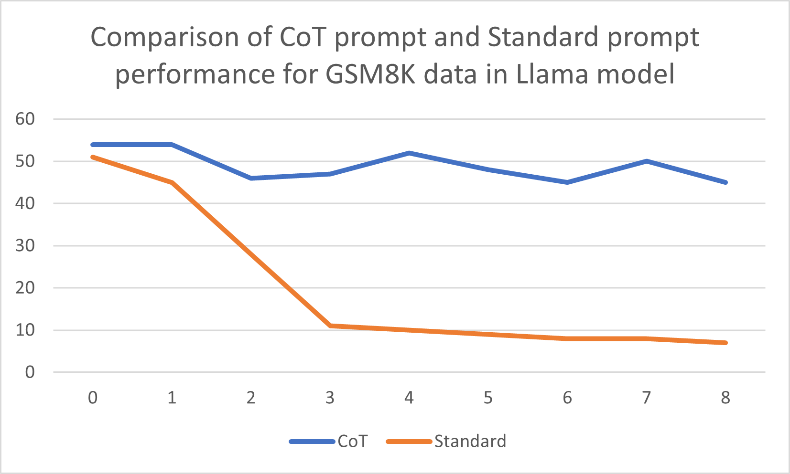

# Reasonability-of-LLMs-An-Experiment-with-PaLM-text-bison-001 and Llama 2
 

 ## A Short Description of Our Work:
 Hi! Welcome and thank you for your interest in exploring our work( detailed report is available [here](https://github.com/jvdutt/NLP_project/blob/main/Understanding%20Resaoning%20Ability%20of%20PaLM%2CLLAMA%20Through%20CoT%20Prompts.pdf) )on understanding LLMs( PaLM text bison 001,Llama 2) reasoning ability through various types of CoT prompts( and detailed comparison of standard prompt vs CoT prompt).

 ## Obtained Results in PaLM:
 
 
 
 
 

 ## Obtained Result in Llama 2:
 
 
 
