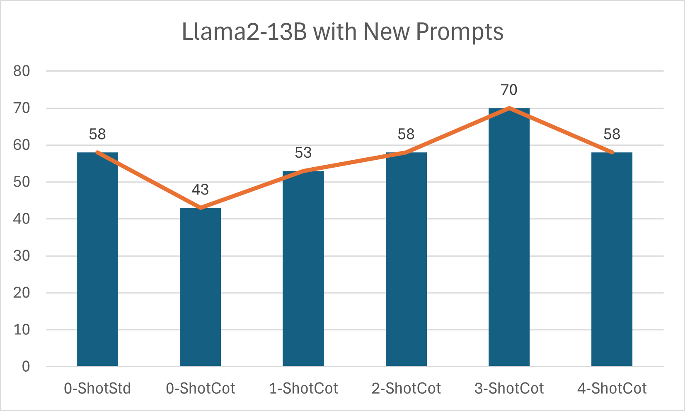
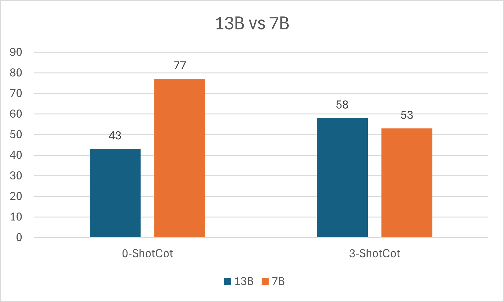
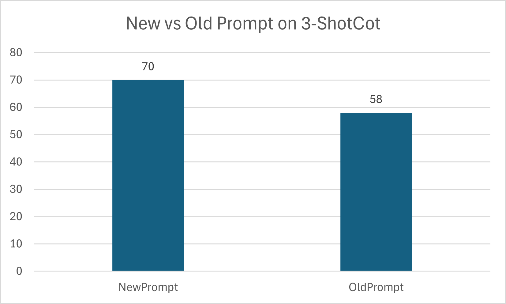

# Reasonability-of-LLMs-An-Experiment-with-PaLM-text-bison-001 and Llama 2
 

 ## A Short Description of Our Work:
 Hi! Welcome and thank you for your interest in exploring our work( detailed report is available [here](https://github.com/jvdutt/NLP_project/blob/main/Understanding%20Resaoning%20Ability%20of%20PaLM%2CLLAMA%20Through%20CoT%20Prompts.pdf) )on understanding LLMs( PaLM text bison 001,Llama 2) reasoning ability through various types of CoT prompts( and detailed comparison of standard prompt vs CoT prompt).

 ## Obtained Results in PaLM:
 
 
 
 
 

 ## Obtained Result in Llama-2-7B-chat-GPTQ:
 
 
 
## Obtained Result in Llama-2-13B-chat-GPTQ:
---------------------------
Comparing New vs Old Promptings with Llama2-13B for 3-ShotCot, the numbers given in the graph are
the total number of correct answers outof 254 from AQuA Dataset.

---------------------------
Comparing Llama2 13B,7B in Cot prompting, the numbers given in the graph are the total number of
correct answers outof 254 from AQua Dataset and Note that 0-ShotCot means just adding ”Let’s think step by
step.” at the end of the standard prompt.

---------------------------
Llama2-13B with New Prompts,the numbers given in the graph are the total number of correct answers
outof 254 from AQuA Dataset,Difference between 0-ShotStd,0-ShotCot is that whole prompt is suffixed by ”Lets
think step by step.” for 0-ShotCot.

